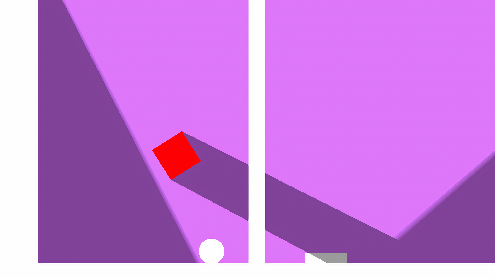

# The Blazing Ball
A fun and complex platformer and puzzle game for android, available in playstore at: https://play.google.com/store/apps/details?id=com.RectifierGames.TheBlazingBall&hl=en
 
This game was developed by me in 2021. It has a total of 10 levels each filled with interactive mechanincs and brain-hurting puzzles. I uploaded the scripts used in this game, mainly for myself to look at but you can too.
## Mechanics
This game implements various game mechanics with its own unique code that brings it to life. To name some, they are: 
1. UI and menus
2. Level selector
3. Gravity and reverse gravity
4. Doors and Traps
5. Objects influenced by gravity and reverse gravity
6. Buttons and pressure plates to trigger events
7. Force field
8. Physics and friction
## Visuals

## Additional
The scripts may not be documended as it was uploaded directly from the project. The code should be self explanatory as it uses quite simple concepts, if you are unable to make sense of it you can always ask your prefered ai companion for help. The scenes and gameobjects are not mentioned or provided, so its just the code.  
If you like the game or appreciate my effort, you may leave a review in the playstore.
